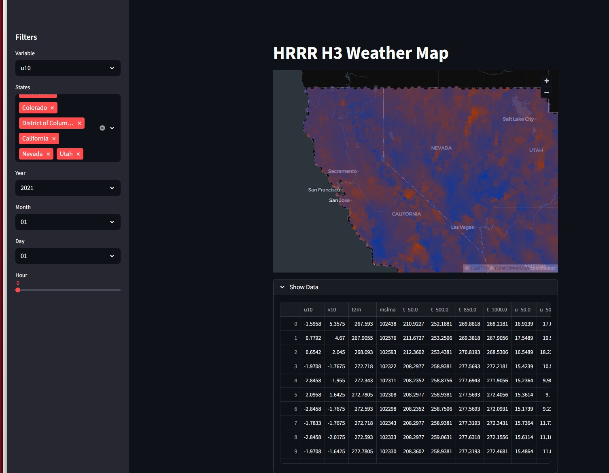

# HRRR Visualization

## Project Overview

We are currently in the model development stage of the GSR CONUS project. To model wind speed across the CONUS region, we used 24 meteorological variables derived from HRRR and built three initial modeling approaches. Our work focused on constructing a wind-speed modeling pipeline, organizing HRRR features within the H3 hexagonal grid system, and visualizing spatial wind patterns by linking H3 cells with wind-related attributes.

## Data

This project uses meteorological data from the **HRRR (High-Resolution Rapid Refresh)** weather model [HRRR Official Website](https://rapidrefresh.noaa.gov/hrrr/) to build wind speed modeling pipelines across the CONUS region.

## Dashboard

We developed an interactive **Streamlit dashboard** (`app.py`) to visualize the processed HRRR data.

The dashboard displays wind-related variables aggregated on an **H3 hexagonal grid with resolution = 5**, covering the **entire CONUS (Continental United States)**.

### Example

## Environment 

Please refer to `requirements.txt`!
